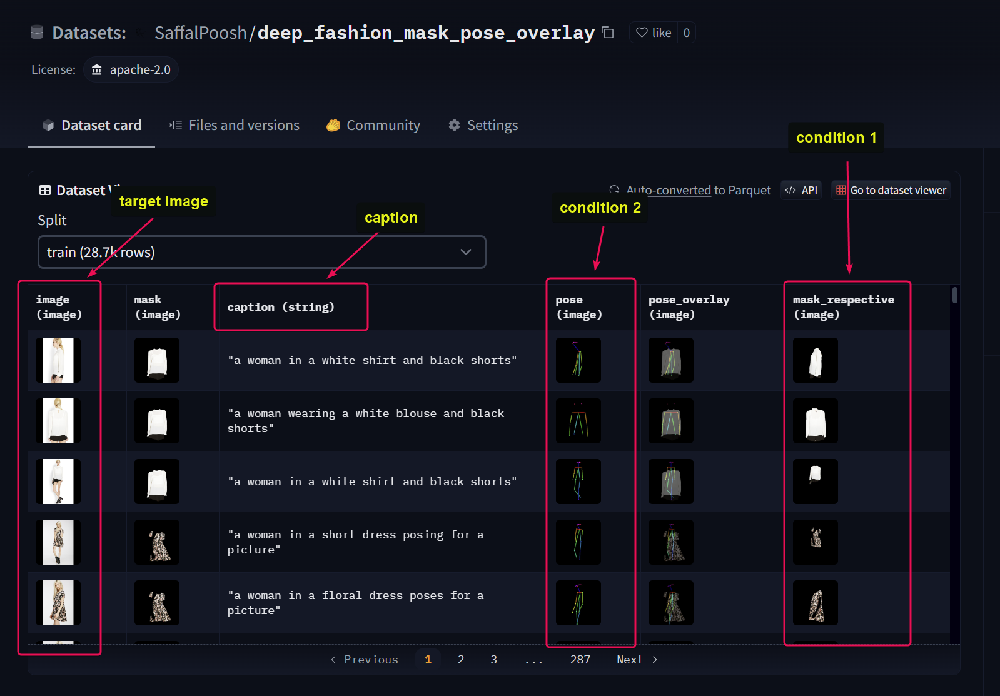

# Install requirements

```bash
pip install -r requirements.txt
```


# Train

Devices corresponds to the gpus to be used for training, if machine has 4 gpus then devices can be 0 1 2 3
 


# Traininng Adapters

## Multiple T2I adapters + CoAdapter fusion

```bash

python train.py --dataset_name SaffalPoosh/deep_fashion_mask_pose_overlay  --n_adapters 2   --adapter_names sketch openpose  --learning_rate  1e-5   --shuffle True  --conditioning_image_column   mask_respective  pose  --batchsize  4 --image_column image  --caption_column  caption  --max_train_samples  5000  --dataset_cache_device "cuda:0"  --checkpoint_every_n_train_steps  200  --checkpoint_dirpath  sdxl_ckpts_dummy  --max_epochs 5  --accumulate_grad_batches 4  --devices 0 1 2 3  --with_coadapter
```


## multiple T2I adapters + MultiAdapter fusion

```bash

python train.py --dataset_name SaffalPoosh/deep_fashion_mask_pose_overlay  --n_adapters 2   --adapter_names sketch openpose  --learning_rate  1e-5   --shuffle True  --conditioning_image_column   mask_respective  pose  --batchsize  4 --image_column image  --caption_column  caption  --max_train_samples  5000  --dataset_cache_device "cuda:0"  --checkpoint_every_n_train_steps  200  --checkpoint_dirpath  sdxl_ckpts_dummy  --max_epochs 5  --accumulate_grad_batches 4  --devices 0 1 2 3 
```


## Single T2I adapter

```bash

python train.py --dataset_name SaffalPoosh/deep_fashion_mask_pose_overlay  --n_adapters 1   --adapter_names openpose  --learning_rate  1e-5   --shuffle True  --conditioning_image_column  pose  --batchsize  4 --image_column image  --caption_column  caption  --max_train_samples  5000  --dataset_cache_device "cuda:0"  --checkpoint_every_n_train_steps  200  --checkpoint_dirpath  sdxl_ckpts_dummy  --max_epochs 5  --accumulate_grad_batches 4  --devices 0 1 2 3 
```


> 📢 *Note*: All conditional images must be RGB images.





# Inference 

💀 ⚠️ Similar Flags must be given as they were, during training. For example if while trainig the arguments `--with_coadapter  --n_adapters   2  --adapter_names  sketch openpose` were passed then those also need to be passed in the inference script as shown below.


💀 ⚠️ Images must be passed in the same order as set during training, for example while training the adapter names were set as `sketch openpose` and likewise the column names were passed as `--conditioning_image_column   scribble_path  pose_path` which means that `sketch --> scribble_path` and `openpose --> pose_path` so at inference time `--cond_images  scrapped_images_scribble_pose_caption/6_scribble.jpg   scrapped_images_scribble_pose_caption/6_pose.jpg` are also in same order.


```bash
 python inference.py  --checkpoint_path  sdxl_ckpts_dummy/epoch=12-step=4999.ckpt   --cond_images  scrapped_images_scribble_pose_caption/6_scribble.jpg   scrapped_images_scribble_pose_caption/6_pose.jpg   --device cuda:3  --text "A man posing for a photo, 4K" --num_steps  45 --with_coadapter  --n_adapters   2  --adapter_names  sketch openpose
```


Flags `--with_coadapter --n_adapters 2` will control if a single t2i adapter has been used or a codadapter or a multiadapter fusion has been used. See the training guide above for explanation.