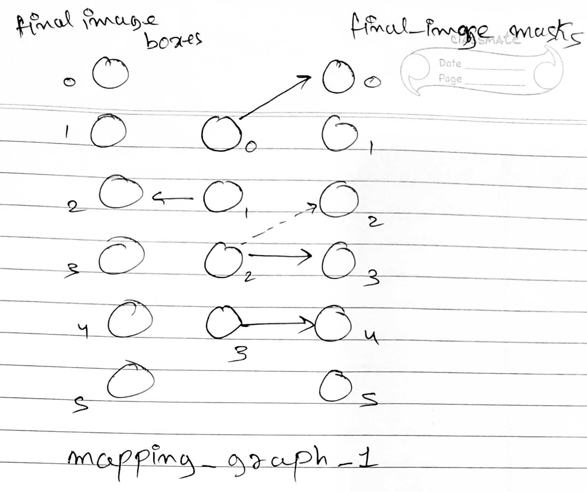
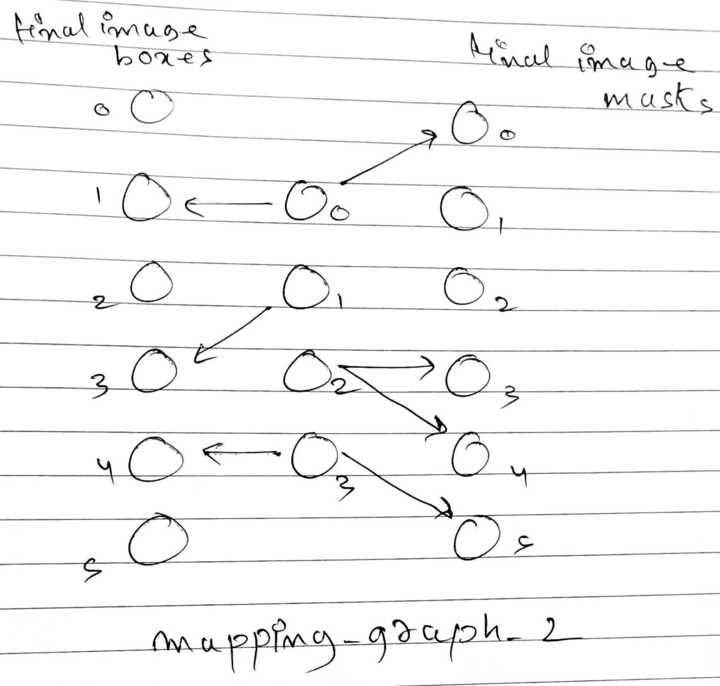

# Misalignment Penalization Scheme Between Storyboard and Generated Image Pair

### Problem space<br><br>
Goal is to filter out data points where the generated image is not aligned with the storyboard image. Since generated image was generated with storyboard image as the conditioning input, the objects in generated image need to respect the positions, orientations and shapes of objects in the storyboard image.
Therefore if the generated image fails to do so, we need to filter that pair out.
<br>
This repo contains the code and details of the algorithm and execution flow to achieve above.
<hr>

### Details of the file ``run.py``:<br><br>
``run.py`` is the main script which contains code to:
- Extract bounding boxes using [GroundingDINO](https://github.com/IDEA-Research/GroundingDINO).
- Extract Segmentation Masks with promptable [Segment-Anything](https://github.com/facebookresearch/segment-anything) using the bounding box outputs from GroundingDINO.
- Calculate object mapping information between storyboard and generated image pair based on segmentation masks and boudning box overlaps. This will be used to create a mapping graph that will serve as input to a custom algorithm to calculate misalignment penalization score.
<br>
Note: The first two steps are encapsulated using an open-source implementation Lang-Segment-Anything (https://github.com/luca-medeiros/lang-segment-anything) which lets you give text prompt and get mask outputs.
<hr>

### Details of algorithm to compute misalignment penalization score between storyboard and generated image pair

Inputs:

- Difference in the number of segmentation masks obtained in storyboard image and final image: **a**
- A dictionary storing the mapping information - **mapping_graph**

Explanation



```python
x = 4 # number of masks in storyboard images (middle column nodes in above graph)
y = 6 # number of masks (or boxes) in final images (first and last column nodes)
a = np.abs(x-y) # 2

mapping_graph = {0: [[0], []], 1: [[], [2]], 2: [[3], []], 3: [[4], []]} 
	misalignment_penalization_score = a + (1-1) + (1-1) + (1-1) + (1-1) = 2

altenate_mapping_graph = {0: [[0], []], 1: [[], [2]], 2: [[2], []], 3: [[4], []]}
	misalignment_penalization_score = a + (1-1) + (1-1) + (1-1) + (1-1) + 1 = 3
```



```python
x = 4 # number of masks in storyboard images (middle column nodes in above graph)
y = 6 # number of masks (or boxes) in final images (first and last column nodes)
a = np.abs(x-y) # 2

mapping_graph = {0: [[0], [1]], 1: [[], [3]], 2: [[3, 4], []], 3: [[5], [4]]} 
	misalignment_penalization_score = a + (2-1) + (1-1) + (2-1) + (2-1) + 2 = 7
```

- *Penalty score*
    - Misalignment penalization score is basically the penalty imposed whenever we find an undesirable case in how the objects in storyboard image is mapped to the objects in final image.
    - Higher this penalty score is, greater the misalignment between the storyboard image and the final image.
- *Mapping graph*
    - Extract the bounding boxes and segmentation masks in storyboard and the final image.
    - calculate the mapping information - which masks (or boxes) in storyboard image are mapped to which masks (or boxes) in final image. Whatever information we get from this, we can visualize it as a graph as shown in above two images (mapping graph 1 and mapping graph 2).
    - Mapping graph basically shows how the objects in storyboard image (middle column nodes) are mapped to objects in final image (first and the last column - first column for boxes and last for masks).
- *Cases corresponding to how objects are mapped*
    - object mask in storyboard image getting mapped to one or more object masks in final image
        - whenever storyboard object gets mapped to more than one mask - undesirable case, so penalized by one unit for each additional mapping.
    - object box in storyboard image getting mapped to one or more object boxes in final image
        - whenever storyboard object gets mapped to more than one box - undesirable case, so this is penalized by one unit for each additional mapping.
    - object in storyboard image getting mapped to some objects masks as well as some object boxes in final image.
        - this is penalized by one for each additional simultaneous mapping.
- *Other undesirable cases*
    - a>0 means either extra objects are there in the generated image or few objects are missing in generated image, so a is added in the penalty score.
    - whenever one object in final image was mapped with more than one object in storyboard image - this is also penalized by one unit for each additional mapping.
        - see mapping graph 1 - if object 2 (indexing is 0-based) was mapped to object 2 in final image (as shown by dotted arrow) - then this would have been an undesirable case and penalized by one unit.
    - if object in storyboard image found no mapping in final image - penalized by one unit.
- Therefore final penalty score will be the sum of all such penalizations.
- *Mapping graph representation*
    - It is stored as a dictionary for each storyboard and final image pair.
    - Key is the object index in storyboard image. Value is a list which contain two sublists - first sublist contains all object indexes corresponding to all the masks with which this object in storyboard image was mapped through masks. Second sublist contain all the object indexes corresponding to all the boxes with which this object in storyboard image was mapped through boxes.
- *Penalty calculation using mapping graph*
    - For each additional mappings of object in storyboard image (as covered and explained above), the penalty is simply calculated as (length_of_sublist_1 + length_of_sublist_2 - 1).
    - next is the 2nd point of ‘other undesirable cases’ section - for that you just calculate the frequency of all indices stored in both the sublists across all keys, and simply subtract one from each of them and add them in the final penalty score.
    - if length_of_sublist_1 = 0 and length_of_sublist_2 = 0, this is handled separately and penalized by one unit.
    - **a** will be added in the final penalty score.
- Below function shows how the score will be calculated based on the mapping graph.

Function to calculate the **misalignment penalization score:**

```python
def misalignment_penalization_score(mapping_graph, a):
    penalty = np.abs(a)
    fmap_freq = {}
    for _, map_list in mapping_graph.items():
        mlist = map_list[0]
        blist = map_list[1]
        l1 = len(mlist)
        l2 = len(blist)
        if l1==0 and l2==0:
            penalty += 1
        else:
            for item in mlist:
                if item in fmap_freq:
                    fmap_freq[item] += 1
                else:
                    fmap_freq[item] = 1
            for item in blist:
                if item in fmap_freq:
                    fmap_freq[item] += 1
                else:
                    fmap_freq[item] = 1
            penalty += (l1+l2-1)
    for freq in fmap_freq.values():
        penalty += (freq - 1)
    return penalty
```
<hr>
